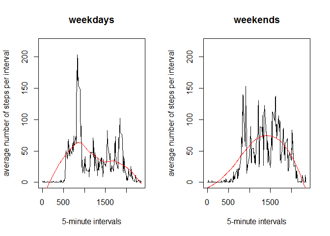

# Reproducible Research: Peer Assessment 1

<br><br>

***

## INTRODUCTION

This report is in fullfillment of Assignment-1 for the Coursera course "Reproducible Research".

The dataset was provided by the instructor. It consists of data from a personal activity monitoring device which measures the number of steps taken in 5-minute intervals.  This data was collected from an anonymous individual every day during the months of October and November, 2012.


The data set consists of 3 variables :

1. **steps**

    This is the number of steps taken in a 5-minute interval.  Missing values are coded as *NA*.  
  

2. **date**

    This is the date on which the measurement was taken, in YYY-MM-DD format.


3. **interval**

    This is the identifier for the 5-minute interval in which measurement was taken.  It corresponds to the time-of-day at the start of the interval, with the last 2 digits refering to the minutes and the remainder referring to the hour.  For example, "750" is the time "07:50", and "1850" is the time "18:50".


<br><br>

***

## LOADING AND PREPROCESSING THE DATA

The data file is in **csv** format, so it is easily read in.  

Once read, it is useful to look at the overall structure and a few of the records from the beginning and end of the database.  It is important to note that there are missing values, encoded as "NA", in the data.  These will be analysed in a later section of this report.


```r
require(knitr)
```

```
## Loading required package: knitr
```

```r
opts_chunk$set( fig.path = 'figures/' )
# set the working directory
setwd("C:/Coursera/ReproducibleResearch/Assignment-1")

# load the data int a dataframe
rawStepData <- read.csv("activity.csv")

# this is what the data looks like 
str(rawStepData)
```

```
## 'data.frame':	17568 obs. of  3 variables:
##  $ steps   : int  NA NA NA NA NA NA NA NA NA NA ...
##  $ date    : Factor w/ 61 levels "2012-10-01","2012-10-02",..: 1 1 1 1 1 1 1 1 1 1 ...
##  $ interval: int  0 5 10 15 20 25 30 35 40 45 ...
```

```r
head(rawStepData)
```

```
##   steps       date interval
## 1    NA 2012-10-01        0
## 2    NA 2012-10-01        5
## 3    NA 2012-10-01       10
## 4    NA 2012-10-01       15
## 5    NA 2012-10-01       20
## 6    NA 2012-10-01       25
```

```r
tail(rawStepData)
```

```
##       steps       date interval
## 17563    NA 2012-11-30     2330
## 17564    NA 2012-11-30     2335
## 17565    NA 2012-11-30     2340
## 17566    NA 2012-11-30     2345
## 17567    NA 2012-11-30     2350
## 17568    NA 2012-11-30     2355
```

  
    

<br><br>

***

## WHAT IS MEAN TOTAL NUMBER OF STEPS TAKEN PER DAY?

For this analysis, missing values in the dataset (that is, NA values) are ignored.


```r
# calculate the total steps taken for all the days, ignoring NA values
sumDailyStepData <- aggregate(steps~date, data=rawStepData, sum, na.action = na.omit)

# make a histogram
hist(sumDailyStepData$steps,
     main="Total number of steps taken for all the days (ignoring missing values)",
     xlab = "Total number of steps")
```

 

```r
# calculate mean and median
rawMean <- mean(sumDailyStepData$steps)
rawMedian <- median(sumDailyStepData$steps)
```

The mean total number of steps taken per day is   10766.2

The median total number of steps taken per day is 10765.0
    
    
<br><br>

***

## WHAT IS THE AVERAGE DAILY ACTIVITY PATTERN?


```r
# calculate the mean of the data in each interval, for all the days
meanDailySteps <- aggregate(steps~interval, data=rawStepData, mean, na.action = na.omit)

# plot as a time series
plot(meanDailySteps$interval, meanDailySteps$steps, type="l",
     main="number of steps taken, averaged over all days",
     xlab = "5-minute intervals",
     ylab = "average number of steps per interval")
```

 

```r
# maximum value
maxMeanSteps <- max(meanDailySteps$steps)

# location of maximum value
intervalLocation <- which.max(meanDailySteps$steps)

# interval that the max value corresponds to
whichInterval <- meanDailySteps$interval[which.max(meanDailySteps$steps)]
```

The maximum mean daily number of steps is 206.1698 .


This occurs at interval 835 .


<br><br>

***

## IMPUTING MISSING VALUES

The analysis is repeated after replacing all the missing values with a 0 (zero).  The reason for 
choosing this value is that we cannot know what the missing values would be.  Given that the nature of the 
data is a measurement of an individual's activity, it is probably safest to assume that no activity took place.


```r
# total number of NA values for steps
totalMissing <- sum(is.na(rawStepData$steps))

# replace the NA values with 0, since we cannot know for sure what that value should be
# Note that the original data is kept intact.
processedData <- rawStepData
processedData$steps[is.na(processedData$steps)] <- 0

sumDailyStepData <- aggregate(steps~date, data=processedData, sum)

# make a histogram
hist(sumDailyStepData$steps,
     main="Total number of steps taken for all the days (missing values replaced)",
     xlab = "Total number of steps")
```

 

```r
# calculate the mean and median of the modified data
processedMean <- mean(sumDailyStepData$steps)
processsedMedian <- median(sumDailyStepData$steps)
```


After replacing the missing values, the mean and median values can be calclulated and compared against the
values previously calculated when the missing values were ignored :


|    | mean | median|
|----|------|-------|
|data with missing values|10766.2|10765.0|
|data with missing values replaced with 0| 9354.2|10395.0|


Note that replacing the missing values with a numeric value has an affect on the mean and median values.

Examining the histogram of the daily total number of steps shows some change in the distribution between the two sets of data.  Note the higher histogram bars in the left-hand side of the curve for the data with missing data replaced compared to the curve when then missing data is ignored.

    
        
<br><br>

***

## ARE THERE DIFERENCES IN ACTIVITY PATTERNS BETWEEN WEEKDAYS AND WEEKENDS?

This analysis examines the difference between activity on weekedays (that is, Monday - Friday) and 
weekends (that is, Saturday - Sunday).  The processsed dataset with missing values replaced is used.


```r
# create a new factor variable with 2 levels, "weekday" and "weekend"
levelWeekday <- weekdays(as.POSIXlt(processedData$date))

# replace the individual days of the weeks with "weekday" or "weekend"
levelWeekday[levelWeekday=="Monday"] <- "weekday"
levelWeekday[levelWeekday=="Tuesday"] <- "weekday"
levelWeekday[levelWeekday=="Wednesday"] <- "weekday"
levelWeekday[levelWeekday=="Thursday"] <- "weekday"
levelWeekday[levelWeekday=="Friday"] <- "weekday"
levelWeekday[levelWeekday=="Saturday"] <- "weekend"
levelWeekday[levelWeekday=="Sunday"] <- "weekend"

# add this information to the existing dataframe
processedData$daytype <- factor(levelWeekday)

# create data sets for weekday and weekend data
weekdayData <- subset(processedData, daytype %in% c("weekday"))
weekendData <- subset(processedData, daytype %in% c("weekend"))

# calculate the means
weekdayMean <- meanWeekdaySteps <- aggregate(steps~interval, data=weekdayData, mean)
weekendMean <- meanWeekendSteps <- aggregate(steps~interval, data=weekendData, mean)

# plot the time series for each data set
par(mfrow=c(1,2))
plot(meanWeekdaySteps$interval, meanWeekdaySteps$steps, type="l", ylim=c(0,220),
     main="weekdays",
     xlab = "5-minute intervals",
     ylab = "average number of steps per interval")
regWeekday <- loess(meanWeekdaySteps$steps~meanWeekdaySteps$interval)
lines(meanWeekdaySteps$interval, predict(regWeekday, meanWeekdaySteps), col='red')

plot(meanWeekendSteps$interval, meanWeekendSteps$steps, type="l", ylim=c(0,220),
     main="weekends",
     xlab = "5-minute intervals",
     ylab = "average number of steps per interval")
regWeekend <- loess(meanWeekendSteps$steps~meanWeekdaySteps$interval)
lines(meanWeekendSteps$interval, predict(regWeekend, meanWeekendSteps), col='red')
```

 


From the plotted data, it appears that there is a distinct difference between weekday and weekend activity.  The weekend activity starts later, ends later, and is overall more active.  In the plots, the time series data is shown in black, and a fitted curve (using the loess() function) is shown in red.

<br><br>

***


